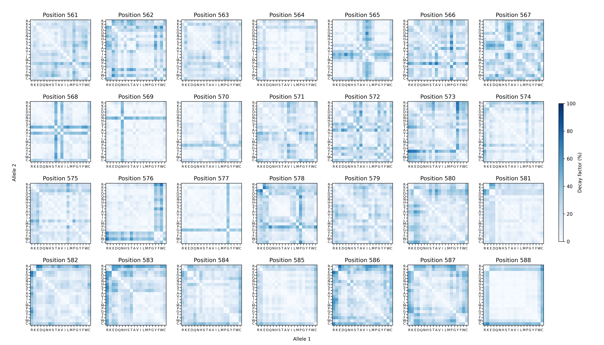

=======================================================================
EpiK: Epistatic Kernels for GPU-accelerated Gaussian process regression
=======================================================================

`EpiK` is a Python library designed to infer sequence-function relationships using Gaussian process models. Built on top of `GPyTorch <https://docs.gpytorch.ai>`_ and `KeOps <https://www.kernel-operations.io>`_, `EpiK` enables fitting these models to large datasets containing hundreds of thousands to millions of sequence measurements.

The library provides a series of highly interpretable kernel functions, parameterized by how specific mutations affect the predictability of other mutations. These parameters can be inferred from data through evidence maximization and visualized as heatmaps to guide the exploration of complex sequence-function relationships. For example, the heatmaps below illustrate how amino acid substitutions at each of the 28 positions in the dataset influence the predictability of mutations at other positions.

`EpiK` harnesses the power of Gaussian process models alongside novel interpretable kernels to analyze large experimental datasets for studying complex sequence-function relationships while rigorously quantifying uncertainty.

Key features include:

- Inference of kernel hyperparameters that determine how specific mutations impact the predictability of other mutations.

- Phenotypic predictions for unobserved sequences.

- Estimation of mutational effects and epistatic coefficients across diverse genetic backgrounds.

- Reconstruction of complete combinatorial genotype-phenotype maps for subsets of positions in specific genetic backgrounds, enabling investigation into how multiple mutations interact.

Citation
========

- Juannan Zhou, Carlos Martí-Gómez, Samantha Petti, David M. McCandlish. 
  Learning sequence-function relationships with scalable, interpretable Gaussian processes (2025)
  In preparation.

.. toctree::
    :maxdepth: 2
    :caption: Table of Contents

    installation
    usage/tutorial.ipynb
    api 
